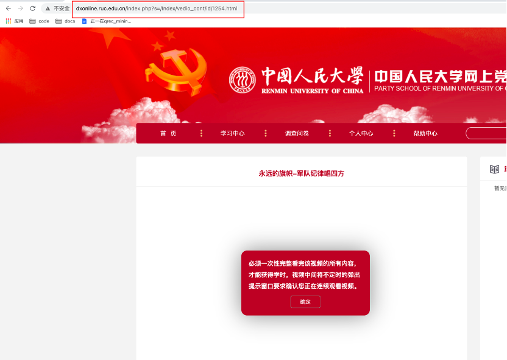

# fuckdk

快速观看党课的小脚本。1分钟刷它个100小时。

**低调使用！**

## Preinstallation

Win/Linux/MacOS都ok。然后你需要一个python3的环境。

用下边的命令装一下requests包。

```pip install requests -i https://pypi.tuna.tsinghua.edu.cn/simple```


## How To Use

### 前期准备：需要给程序配一下cookie来模拟系统登录

1. 在chrome中登录党课系统后，随便点进一个视频，先不要播放。打开chrome控制台（F12），切换至network模式。勾选preserve log按钮。点击“XHR”，使得控制台只保留XHR请求，方便我们查看。（见下图红框处）


2. 播放视频，会刷出两个请求。随便点开一个。找到Request Header中的Cookie字段，把PHPSESSID保存下来，如图中的5fg372a61unqbon83l20gn2tk5


3. 打开```start.py```。修改"全局信息"下面的三个变量，分别是你的姓名，你的学号，以及你上一步的PHPSESSID。这些变量是用来让程序能够登录进这个系统的。

以上三步做完之后，ok，接下来我们可以开始愉快的刷视频了。我们提供了两种刷法，可供选择。


### 刷视频

#### 刷法1：使用懒人脚本刷

```bash batch_start.sh```

若输出的suc都为true，那么就ok了！你的时长应该已经加了不少了:)

如果你想刷更多的视频，你可以更改脚本里的URL中的```$idxstart```与```$idxend```。这个idx是和每个视频页面的链接里的id对应的，如```http://dxonline.ruc.edu.cn/index.php?s=/Index/vedio_cont/id/1093.html```

#### 刷法2：一个一个刷，更有操作感

1. 在学习中心选一个**你还没有看**的的视频，点进去，复制他的链接，如下图。




2. 运行 ```python start.py [URL]``` 其中[URL]为上一步保存的链接，不加引号。如果输出中的suc都为true(如下)，那么你就成功了。

```
python start.py -url http://dxonline.ruc.edu.cn/index.php?s=/Index/vedio_cont/id/1254
740147cd653efec94809844c03b2dfsd009aMTI1NA== 95bd67d597b6e8d2804b09d53b65a9fc 1254 251
{"suc":true,"data":{"create_time":1623057102,"videokey":"1254","time":350,"long_time":"1533"}}
{"suc":true,"data":{"videokey":"1254","time":"763","long_time":"1533"}}
{"suc":true,"data":{"videokey":"1254","time":"1329","long_time":"1533"}}
{"suc":true,"data":{"videokey":"1254","time":0,"long_time":"1533"}}
{"suc":true,"msg":"\u5b66\u65f6\u52a0\u5165\u6210\u529f"}

```

### Notes

你的Cookie过一段时间会过期的（你可以想象你用微人大，如果过好几个小时再刷新页面，往往也会让你重新登陆一下）。因此，**你如果一两天后想继续刷视频，你是需要重新第1-3步获取新PHPSESSID，然后填到代码里的！**
