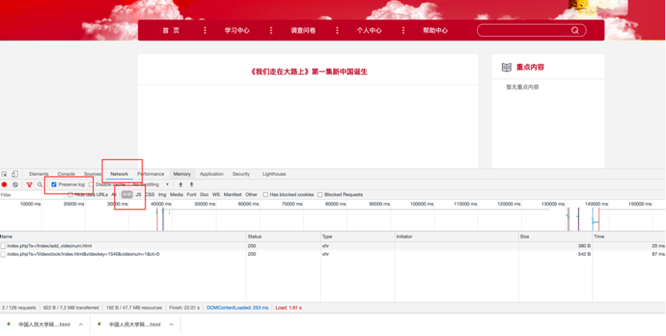
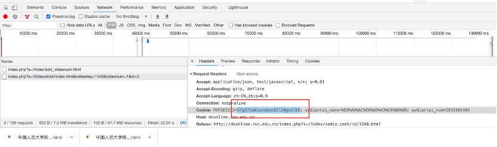

# fuckdk

快速观看党课的小脚本。1分钟刷100学时。

刷的开心, 然后珍惜时间去做更有意义的事情吧！

**低调使用！**

## Preinstallation

Win/Linux/MacOS都ok。

然后你需要一个**python3**的环境。

用下边的命令装一下```requests```包。

```pip install requests -i https://pypi.tuna.tsinghua.edu.cn/simple```


## How To Use 

### 前期准备：需要给程序配一下cookie来模拟系统登录

1. 在chrome中登录党课系统后，随便点进一个视频，**先不要播放**。打开chrome控制台（F12），切换至network模式。勾选preserve log按钮。点击“XHR”，这样会把除了XHR请求外的其他请求过滤掉，更加方便我们查看。（见下图红框处）



2. 播放视频，会刷出两个请求。随便点开一个。找到Request Header中的Cookie字段，把PHPSESSID保存下来，如图中的5fg372a61unqbon83l20gn2tk5



3. 打开```start.py```。修改"全局信息"下面的三个变量，分别修改为你的姓名，你的学号，以及你上一步的PHPSESSID。放心，这些变量只是用来让程序能够登录进这个系统的。

以上三步做完之后，我们接下来就可以愉快的开始刷视频了。刷视频只需要一行命令哈:)


### 刷视频

```python start.py -start 1486 -end 1540```

若输出的suc都为true，那么就ok了！你的时长应该已经加了不少了:)

### 刷更多的视频

如果你想刷更多的视频，你可以更改运行命令中的```start```与```end```参数。

这两个参数对应了你想刷的视频的开始id与结束id。

例如上边的命令中我们将id在[1486,1540]之间的视频都刷了。

这个id是和每个视频页面的链接里的id对应的，比如这个链接

```http://dxonline.ruc.edu.cn/index.php?s=/Index/vedio_cont/id/1486.html```

当然，你也可以只刷一个视频，只需要把start和end填同一个id就好了。


## Notes

你的Cookie过一段时间会过期的（你可以想象你用微人大，如果过好几个小时再刷新页面，往往也会让你重新登陆一下）。因此，**你如果一两天后想继续刷视频，你是需要重复第1-3步获取新PHPSESSID，然后填到代码里的！**
