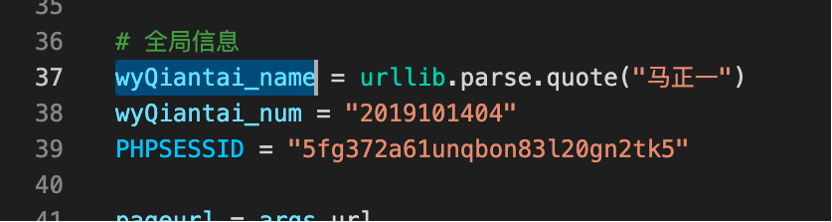

# fuckdk

快速观看党课的小脚本

**低调使用！**

## How To Use

### 前期准备

1. 在chrome中登录党课系统后，随便点进一个视频，先不要播放。打开chrome控制台（F12），切换至network模式。勾选preserve log按钮。点击“XHR”，使得请求只保留XHR请求方便查看。（见下图红框处）


2. 播放视频，会刷出两个请求。随便点开一个。找到Request Header中的Cookie字段，把PHPSESSID保存下来，如图中的5fg372a61unqbon83l20gn2tk5


3. 打开```post_apply.py```。修改37行至39行。其中37行把姓名改成你的姓名。38行把学号改成你的学号。39行把上一步的cookie填进去。这些变量都是用于cookie的，也就是让程序模拟登录这个 系统的。



### 干视频

1. 在学习中心选一个你想干的视频，点进去，复制他的链接，如下图。


2. 运行代码：

3. 运行 ```python post_apply.py [URL]``` 其中[URL]为上一步保存的链接。不加引号。如果输出类似如下，那么你就成功了。

```
python post_apply.py -url http://dxonline.ruc.edu.cn/index.php?s=/Index/vedio_cont/id/1254
740147cd653efec94809844c03b2dfsd009aMTI1NA== 95bd67d597b6e8d2804b09d53b65a9fc 1254 251
{"suc":true,"data":{"create_time":1623057102,"videokey":"1254","time":350,"long_time":"1533"}}
{"suc":true,"data":{"videokey":"1254","time":"763","long_time":"1533"}}
{"suc":true,"data":{"videokey":"1254","time":"1329","long_time":"1533"}}
{"suc":true,"data":{"videokey":"1254","time":0,"long_time":"1533"}}
{"suc":true,"msg":"\u5b66\u65f6\u52a0\u5165\u6210\u529f"}

```


